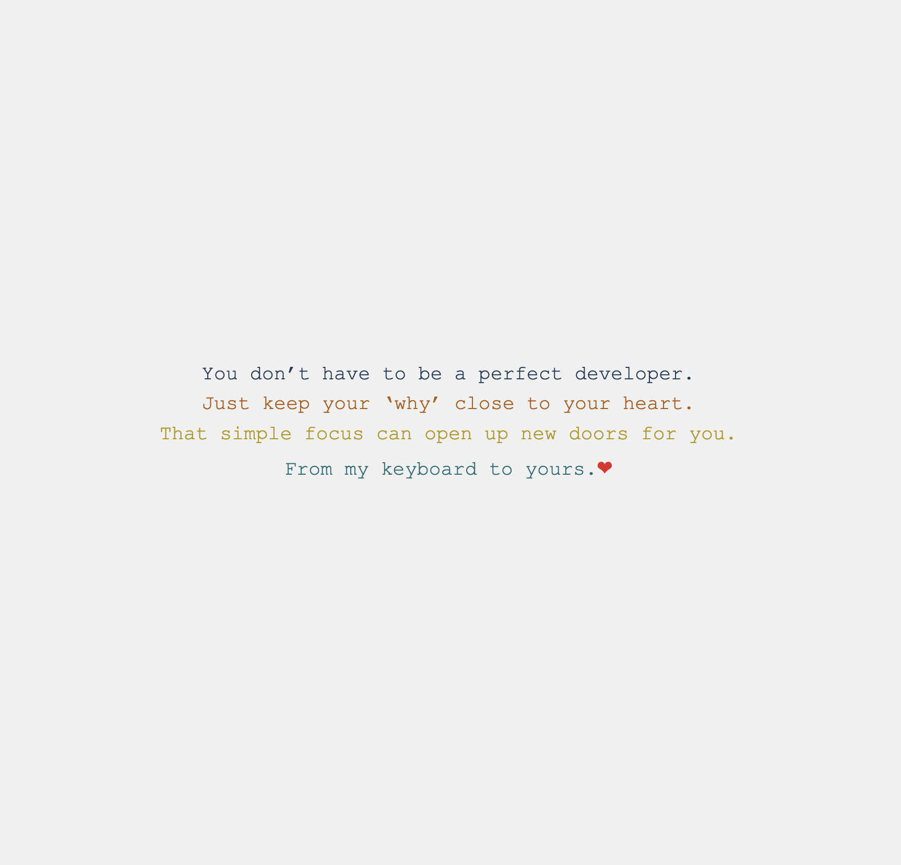
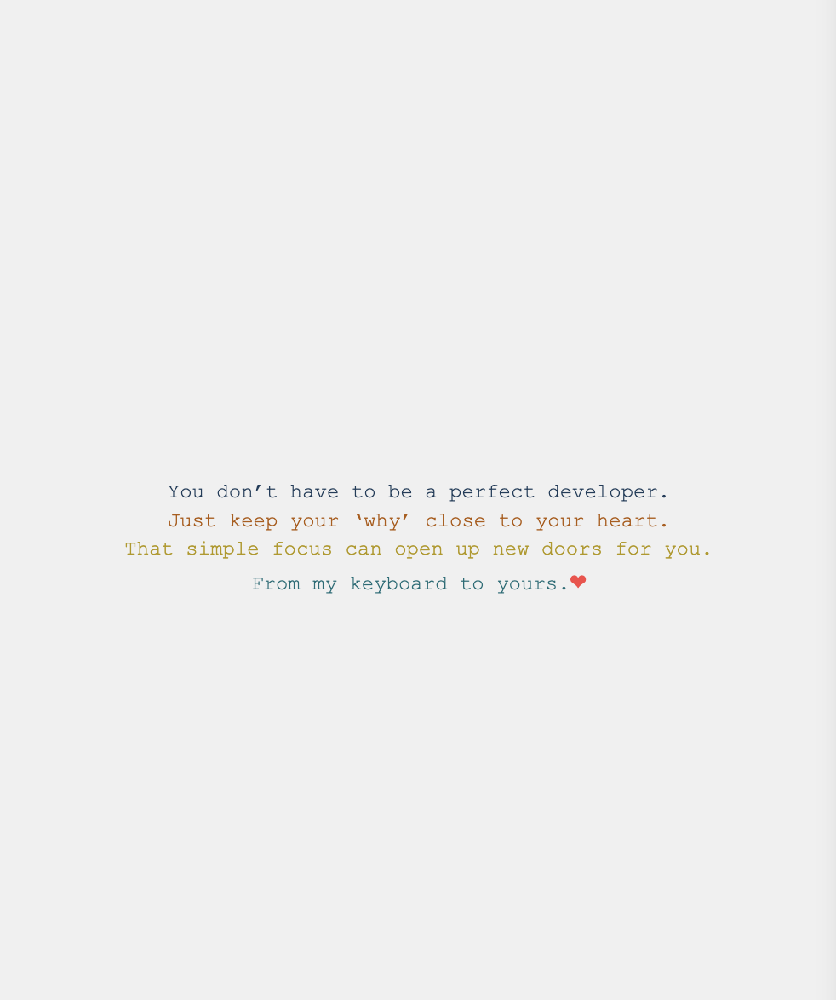

# Animated Text Project

This mini-project is a part of my journey in exploring CSS animations.

- [Animated Text Project](#animated-text-project)
  - [Overview](#overview)
    - [The challenge](#the-challenge)
    - [Links](#links)
  - [Screenshots](#screenshots)
  - [My process](#my-process)
    - [Built with](#built-with)
    - [What I learned](#what-i-learned)
    - [Continued development](#continued-development)
    - [Useful resources](#useful-resources)
  - [Author](#author)

## Overview

### The challenge

- Create an engaging text animation where each line types out sequentially
- Ending with a pulsing heart emoji
- Ensure the design is responsive and accessible across different devices

### Links

- Repository: [GitHub Repo](https://github.com/Doileo/animated-text)
- Live Site URL: [GitHub pages link](https://doileo.github.io/animated-text/)

## Screenshots

<table>
  <tr>
    <td>
      <strong>Desktop View</strong> 
       
    </td>
    <td>
      <strong>Mobile View</strong> 
       
    </td>
  </tr>
</table>

## My process

### Built with

- Semantic HTML5 markup
- CSS custom properties
- CSS animations and keyframes
- Flexbox for layout

### What I learned

In this project, I explored several key CSS animation techniques:

- I learned how to use @keyframes to create animations, like text typing and a pulsing heart.
- Created animations with delays, steps, and loops to make the text appear line by line.

### Continued development

In future projects, I aim to:

- Experiment with more complex animations and transitions.
- Enhance interactivity with JavaScript.
- Further improve accessibility features.

### Useful resources

- [CSS Tricks - Keyframe Animation Syntax](https://css-tricks.com/snippets/css/keyframe-animation-syntax/)
- [MDN Web Docs - Using CSS animations](https://developer.mozilla.org/en-US/docs/Web/CSS/animation)
- [WebAIM - Contrast Checker](https://webaim.org/resources/contrastchecker/)

## Author

- LinkedIn - [@Doina](https://www.linkedin.com/in/doinaleovchindeveloper/)
